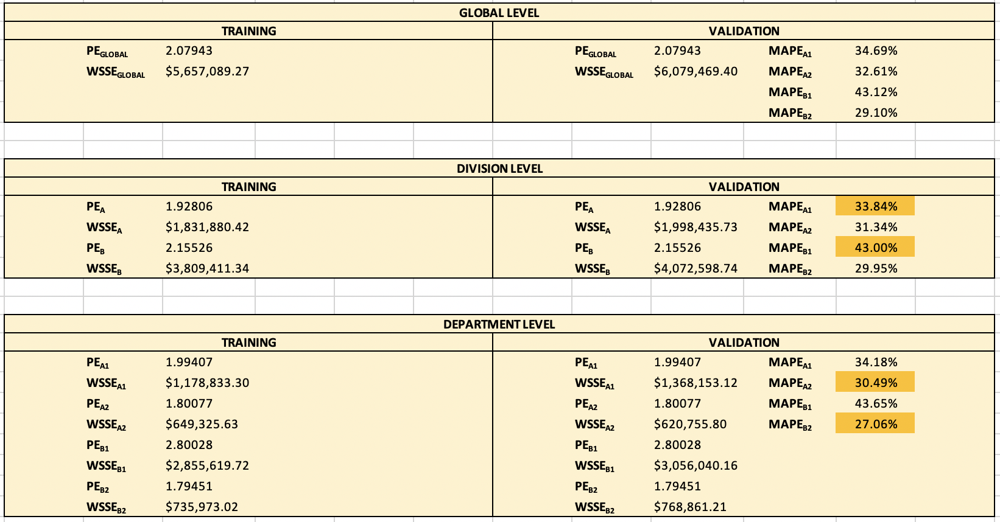
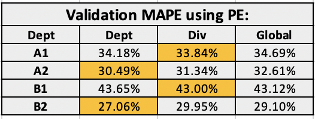

### DS853 Applied Multivariate Analysis

#### Objective
Using cross validation, non-linear weighted regression and Excel data manipulation to determine the optimal level of aggregation (Global, Division, Department) to be used for predicting retail demand promotional lifts.

#### Analysis Details:
* Randomly split dataset into two halves: training & validation.
* Use the training data to estimate PE at the Dept level for each Dept, at the Div level for each Div, and at the Global level (just one).
* Use the validation data to calculate three MAPE values for each Dept:
  * using the PE for that Dept
  * using the PE for that Dept’s “parent” Div
  * using the Global PE
  * For each Dept select the PE level which minimizes MAPE

#### Snapshots

