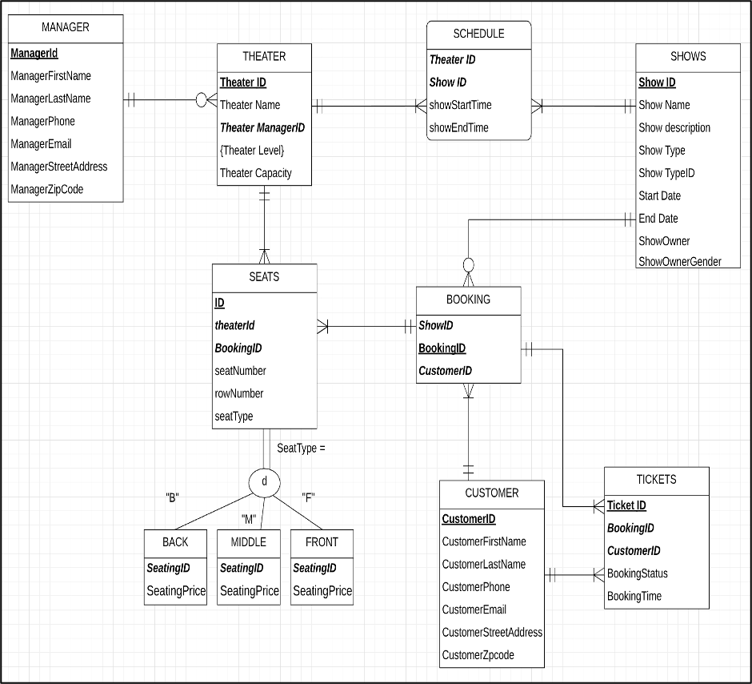
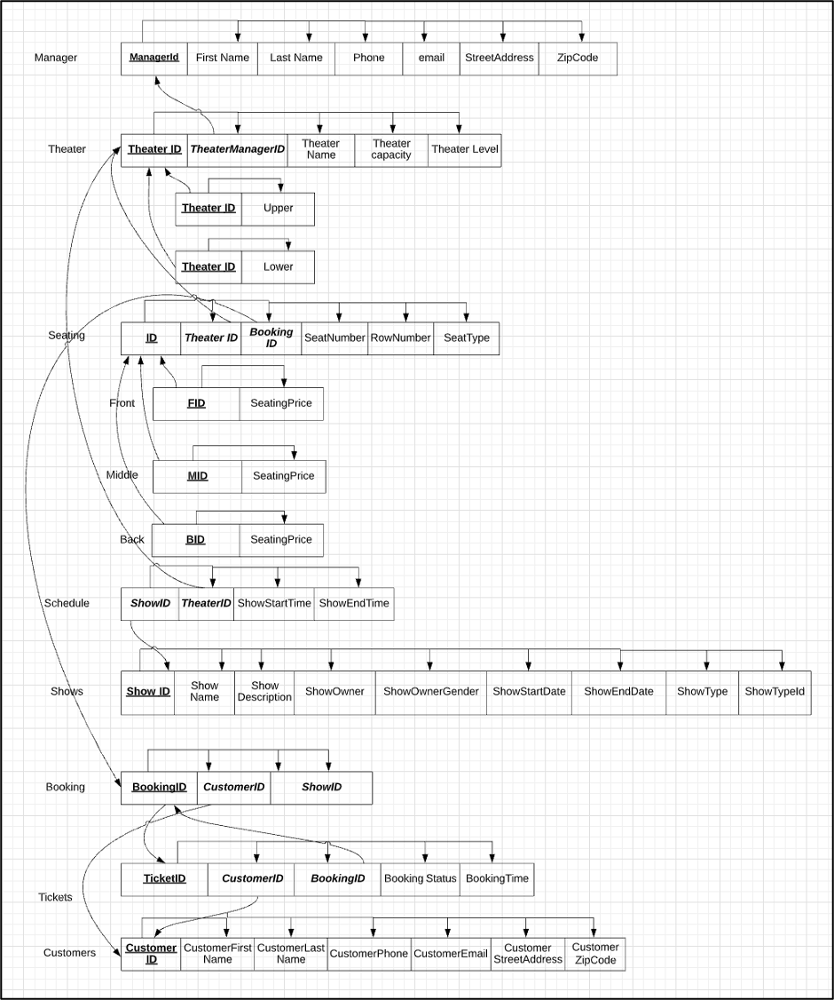

## Mavericks Arena Ticket Booking System

#### Introduction
Mavericks Arena is a fictitious organization that falls under the business sector of the amphitheater industry. Mavericks Arena stages both indoor and outdoor shows. The shows include stage plays, dance, musicals, movies, and performances associated with local youth cricket, football, and rugby teams.  
The amphitheater is a commercial center that attracts customers day in and day out. Since many simultaneous events happen at the amphitheater, an efficient booking system is required to handle the humongous amount of data related to various show bookings, their seat reservations, including printing of tickets. For the project, we wanted to model the database of such an organization that is capable of handling simultaneous transactions of show listings, theater management, customer bookings, seat reservations, and ticket printing. Hence, we came up with the concept of Mavericks Arena.

#### Entities
Mavericks Arena’s schema consists of multiple entities. Below mentioned are the details for each of the entities.

- **Shows**: It contains the list of all the shows and their attributes such as name, description, owner, start date, and end date. A show can either be indoor or outdoor, which is denoted by its show type.
- **Theater**: It contains the listing of all the theaters in the Maverick Arena and their attributes, such as name, manager, seating capacity, and theater level. Mavericks Arena is a multi-level amphitheater; hence theaters are located either at the lower or upper level.
- **Manager**: In the manager entity, details of all the theater managers such as first and last name, contact details (email and phone), and their residential address are stored.
- **Show Schedule**: This entity captures all the show listings for a particular theater. Details like theater id, show start time, and show end time are stored.
- **Seats**: All the details about the seating capacity of the theater like seat number and row number are present within this entity. The seat type determines the price of the seat.
- **Customers**: It contains information about the customers of Mavericks Arena, customer details such as their first and last name, contact details (email and phone), and their address are stored.
- **Tickets**: An issued ticket can only belong to a single show of Mavericks Arena. In this tickets entity, details about booking id, customer id, booking status, and booking time for every ticket gets stored.
- **Booking**: This entity contains booking id and its associated information such as show id and customer id.

#### Business Rules
The below mentioned business rules govern Mavericks Arena:

- One and only one manager can manage a theater.
- A manager can manage zero or multiple theaters.
- A theater has at least one seat and may have multiple seats.
- A seat type can be a front, middle, or back but not all of them simultaneously.  

- A show can either be indoor or outdoor, but not both of them at the same time.  
- For a show booking, an individual seat assignment can be done only once.
- A theater can schedule one or multiple shows, but two shows cannot have the same timings.
- A show can be scheduled in one or more theaters within the Mavericks Arena.
- Each booking results in at least one ticket generation and can have multiple tickets associated with it.
- An issued ticket can only belong to a single customer.
- A customer in the database must be associated with a booking.

#### EER Diagram

#### 3NF Relational Model

#### SQL Statements
1. Mavericks_Arena_DDL.sql contains create table statements.
2. Mavericks_Arena_DML.sql contains insert statements.
3. Mavericks_Arena_Queries.sql contains sample queries.