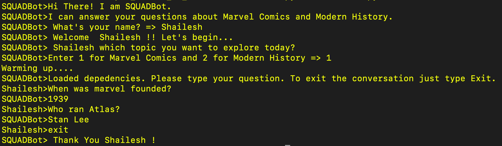

## Factoid Based Question Answering Chatbot

#### Introduction
This chatbot is a more simplistic version of a question answering systems developed utilizing a subset of SQuAD(Stanford Question Answering Dataset). The chatbot utilizes information retrieval and natural language processing techniques to provide answers to the user query for topics such as Marvel Comics and Modern History.

#### Installation
1. Clone or copy the contents of the directory.
2. There are some python package dependencies such as nltk which needs to be installed.
3. Once the dependencies are installed, to run the chatbot on the command line execute
```sh
   $ python3 ChatBot.py
```
4. The Chatbot will be ready to answer your questions.

#### A Sample Conversation


#### Architecture
For the understanding and implementation purpose, I replicated the architecture of the IR-based question answering system described in Jurafsky & Martin Speech And Language Processing book.Below mentioned are the core components of the system.
1. **Data Loader**: This module is responsible for extracting the paragraphs for the topics from the SQuAD json files. The topic name needs to be passed to the module to extract all the paragraphs for the specific topic.
2. **Query Parser**: This module uses the user question as an input and processes it to determine the question type, expected answer type, and also vectorize the user query for answer extraction.
3. **Answer Extraction**: In the answer extraction module, using the query vector first, the relevant paragraphs are extracted from the paragraphs for the chosen topic. Using TF-IDF as a feature, the cosine similarity between the query and paragraph vectors gets computed, and the top three relevant paragraphs are determined.  
We utilized Laplace smoothing or the Add-1 smoothing to avoid division by zero when computing IDF. After extracting relevant paragraphs, the most relevant sentences are extracted by first tokenizing the sentences of the relevant paragraphs and then computing n-gram similarity between question and sentence.  
 Finally, based on the expected answer type, the system using the named entity recognition technique and part of speech tagging determines the correct answer, which gets displayed to the end-user.

#### Results
The average exact match accuracy of the system is **67.57%** 
