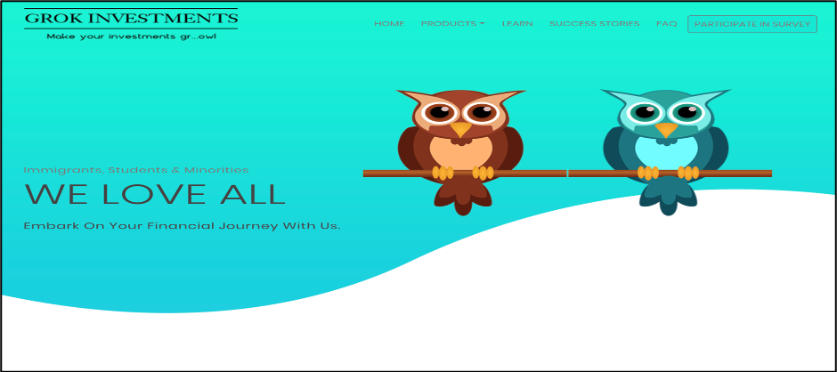
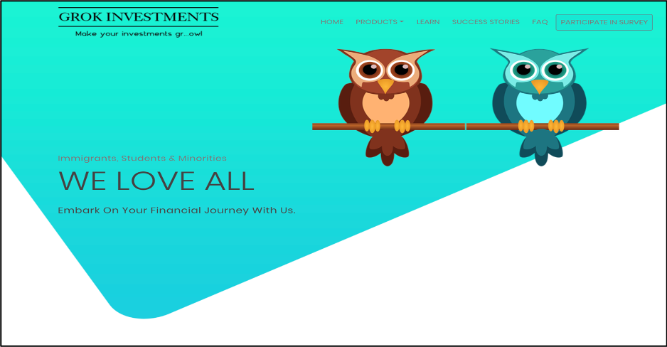
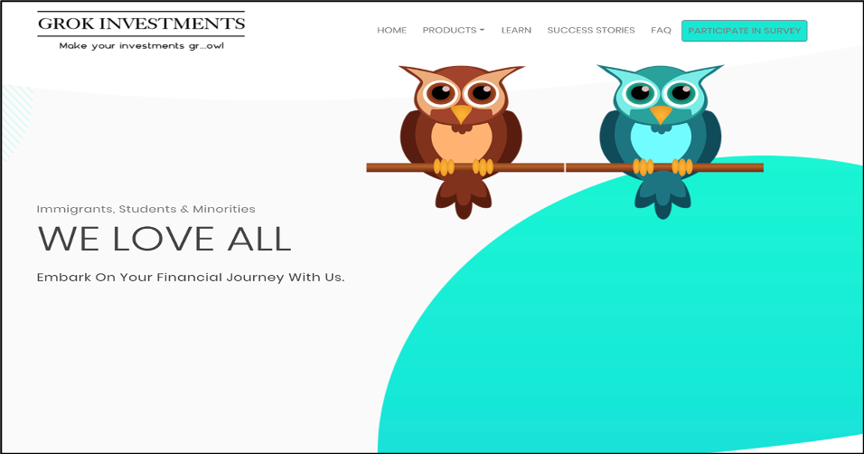
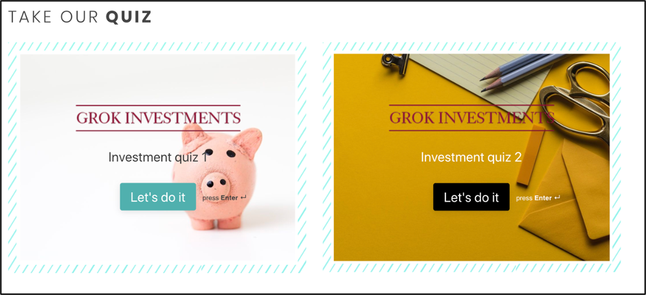
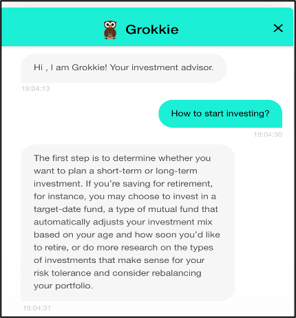
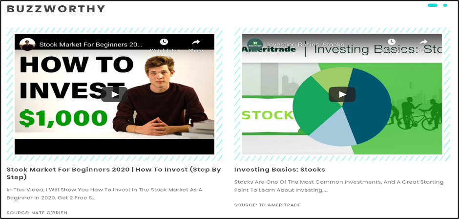
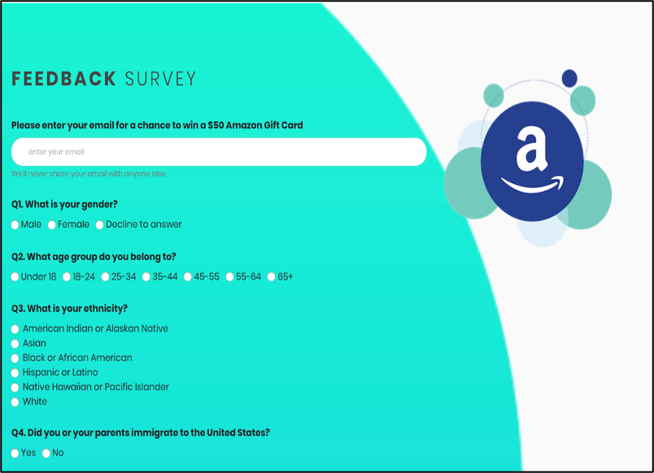

## Grok Investments
Website Link [Grok Investments](http://grokinvestments.com/)
#### Introduction
- In today's day and age, the company's website is an essential primary platform for the customer to begin their relationship with the company.
- GrokInvestments was designed with the goal of finding out what aspects of investing one’s money are interesting/attractive to the public today, and what aspects deter the public from going ahead with investing a part of their income. 
-  Using the minimalistic approach, we incorporated a clean layout and easy navigation on the website. Some of the prominent features of our website include investment quizzes, an interactive chatbot, immigrant success stories, and a full-fledged learning portal.
- The content on our website is well-curated to satisfy our site visitor's inquisitiveness, and it resonates well with the product motto of intuitive learning. 
- Feedback plays a vital role in product improvement. We included a user survey on our website to seek suggestions and collect demographic, ethnic, and income-related information for further analysis. 

#### Landing Pages (A/B/n Testing) 
- Landing Page Variant #1

- Landing Page Variant #2

- Landing Page Variant #3

#### Website Features
- Learning Portal

- Immigrant Stories

- Quiz
  
- Chatbot  
   
- Featured Content   

- Feedback Survey   

